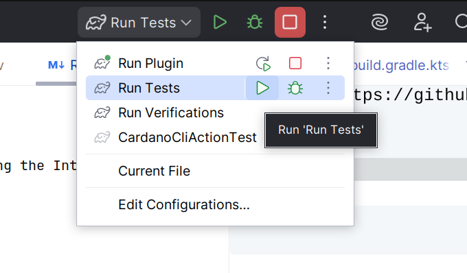

# CardanoPyC Pycharm  Plugin


![IntelliJ Platform Plugin Template][file:intellij-platform-plugin-template-dark]
![CardanoPyC Plugin][file:intellij-platform-plugin-template-light]

[][jb:github]
[](https://twitter.com/JBPlatform)
[][gh:build]
[](https://plugins.jetbrains.com/slack)

---
<!-- Plugin description -->
CardanoPyC is a powerful IntelliJ-based plugin that provides seamless support for Haskell and Plutus development with deep integration to the Cardano blockchain. It enhances developer productivity by offering:

- **Advanced Haskell Support**: Syntax highlighting, code completion, and file creation for Haskell files (.hs)
- **Cardano Blockchain Integration**: Direct access to Cardano API data through the Run menu
- **Real-time Blockchain Data**: Fetch latest blocks, network state, transactions, pool information, and more
- **Deployment Utilities**: Generate addresses 
- **Wallet Management**: Integrated wallet management capabilities


This plugin is perfect for developers building on the Cardano blockchain, enabling smooth and efficient smart contract development within the IntelliJ ecosystem.
<!-- Plugin description end -->

---

## 📥 Installation

1. Clone the repository:
   ```
   git clone https://github.com/AIQUANT-Tech/CardanoPyC
   cd CardanoPyC
   
2. Debug the extension by clicking the Intellij IDE debug icon.

## 🏗️ Development

### ✅ Running Tests





# 🚀 Features

## 🎯 Haskell Language Support
- File type recognition for `.hs` files
- Advanced syntax highlighting for Haskell and Plutus code
- Intelligent code completion
- Custom parser definition for Haskell syntax


## 🔗 Cardano API Integration (Run Menu > CardanoAPI)
- **Blockchain Data**: Latest block details, network state, protocol parameters
- **Address & Transactions**: Address balances, transaction details, transaction lists by address
- **Stake Pools**: Pool details, status, lists, expiring/expired pools
- **Governance**: Committee members, DRep information, governance actions
- **Assets & Policies**: Asset details, policy information, assets by address
- **Stake Keys**: Address associations with stake keys


## 💼 Wallet Management

- The plugin includes integrated wallet management tools for handling Cardano wallets directly inside your IDE.
- CardanoPyC provides built-in **wallet support** for Plutus developers.

#### ✨ Wallet Features
- Create and manage local Cardano wallets.
- Import wallet via mnemonic or keys.
- Display wallet balance in real time.
- Export addresses for transactions or testing.


#### 🛠️Usage
1. Go to Run Menu`ctrl + shift + a` → Wallet →  This opens the Wallet Management User Interface

2. Choose an action:
    - **Create Wallet** → Generates a new wallet with mnemonic and saves it securely.
    - **Import Wallet** → Paste your mnemonic/private key to load an existing wallet.
    - **View Balance** → Fetches live balance from the connected Cardano node.
    - **Export Address** → Copies wallet address for transactions or deployment.


## Deployment Tools

#### 🔹 Generate Plutus Script Address
The plugin provides an easy way to generate Cardano addresses from your Plutus scripts:

- **📋 Access the Tool**:
    - Run Menu `ctrl + shift + a`> Deployment > Generate Address
    - Right-click in the editor → *Generate Plutus Address*

- **🎯 Configure Parameters**:
    - Enter the path to your Plutus script file (without the `.plutus` extension)
    - Select the network: Preview, Preprod, or Mainnet
    - Click **OK**

- **🎯 Output**:
    - A `.addr` file with the same name as your script will be generated
    - A success notification shows the generated address and file location

👉 Example: If your script is `myscript.plutus`, the address file will be `myscript.addr`.

---


## 📋 Prerequisites

- For generating addresses → cardano-node & cardano-cli must be installed (but node doesn’t need to be running).


## Development Environment

- IntelliJ IDEA version 231.x or higher

- Java 17+ runtime environment

- Minimum 4GB RAM recommended
## 🏗️ Project Structure
```
CardanoPyC/
├── images/
├── src/
│   ├── main/
│   │   ├── java/
│   │   │   └── org/intellij/sdk/language/
│   │   │       ├── actions/                 # Menu actions and handlers
│   │   │       ├── cardanoApi/              # Cardano API integration
│   │   │       │   ├── actions/             # API action classes
│   │   │       │   ├── CardanoScanApiClient.java
│   │   │       │   └── CardanoScanFetcher.java
│   │   │       ├── deployment/              # Node deployment utilities
│   │   │       │   ├─CardanoCliAction
│   │   │       │   
│   │   │       ├── grammars/                # Language grammar definitions
│   │   │       ├── highlighter/             # Syntax highlighting
│   │   │       ├── icons/                   # Plugin icons
│   │   │       ├── parser/                  # Language parsing
│   │   │       ├── psi/                     # PSI tree elements
│   │   │       ├── utils/                   # Utility classes
│   │   │       └── wallet/                  # Wallet management
│   │   └── resources/
│   │       ├── icons/                       # Image resources
│   │       │   ├── cardano.svg
│   │       │   ├── plugin-hs-Icon.svg
│   │       │   └── background.jpg
│   │       └── META-INF/
│   │           └── plugin.xml              # Plugin configuration
│   └── test/                               # Test classes
├── build.gradle.kts                        # Gradle build configuration
├── gradle.properties                       # Project properties
├── settings.gradle.kts                     # Gradle settings
└── README.md                               # This file           # Plugin icons
```

## 🛠️ Build Configuration
The project uses Gradle with the IntelliJ Platform Plugin. Key configuration files:
- `build.gradle.kts` - Gradle build configuration
- `gradle.properties` - Project properties and versions
- `plugin.xml` - Plugin manifest and extension points

## 🎨 Icons
- Custom icons located in `/icons/` directory
- Main plugin icon: `plugin-hs-Icon.svg`
- Cardano-specific icons: `cardano.svg`

## 🤝 Contributing

We welcome contributions! Please feel free to submit pull requests or open issues for bugs and feature requests.

## 🆘 Support

For issues or questions related to the CardanoPyC plugin, please contact AIQUANT TECHNOLOGIES support through the plugin's GitHub repository.

## 📄 License

This project is licensed under the Apache License - see the LICENSE file for details.

---

*Note: This plugin requires IntelliJ IDEA version 231.x or higher and Java 17+ for optimal performance.*

[//]: # (Keep the existing links section from the original template)
[docs]: https://plugins.jetbrains.com/docs/intellij?from=IJPluginTemplate
[gh:build]: https://github.com/JetBrains/intellij-platform-plugin-template/actions?query=workflow%3ABuild
[jb:github]: https://github.com/JetBrains/.github/blob/main/profile/README.md
[file:intellij-platform-plugin-template-dark]: ./.github/readme/intellij-platform-plugin-template-dark.svg#gh-dark-mode-only
[file:intellij-platform-plugin-template-light]: ./.github/readme/intellij-platform-plugin-template-light.svg#gh-light-mode-only
